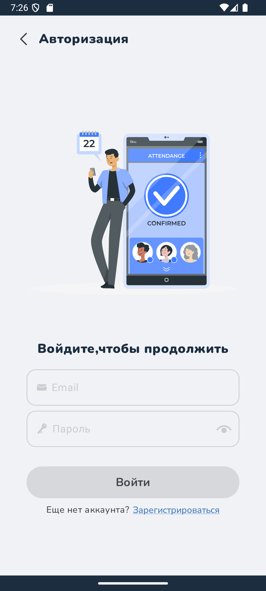
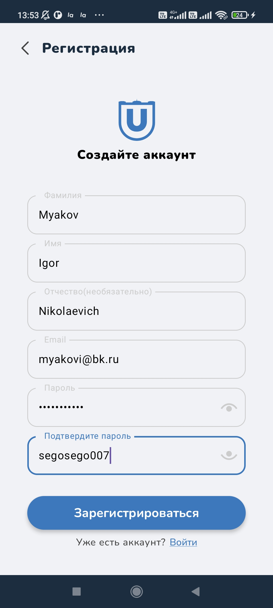
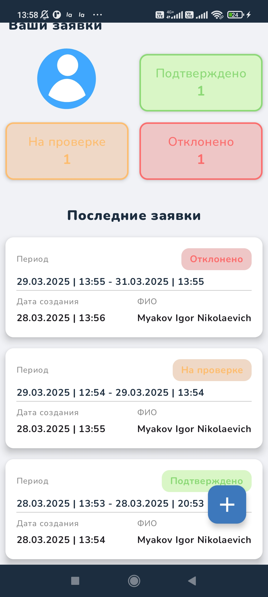
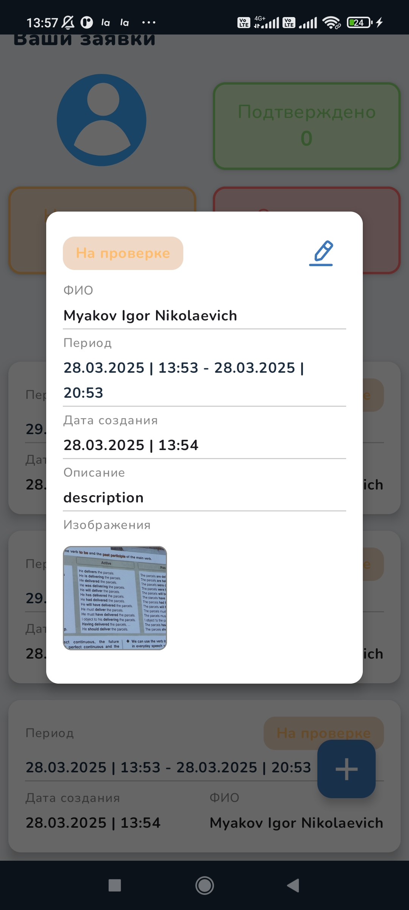
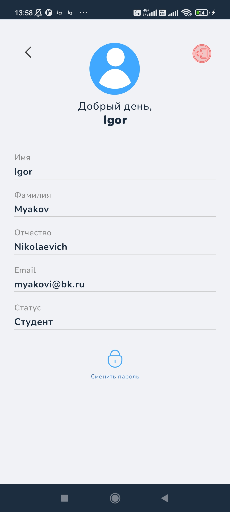

# 🕒  TSU.NotInTime

## 📚 Libraries and tools used
- JetpackCompose
- Material 3
- Coil
- Glide
- Retrofit
- Okhttp3
- Koin
- Accompanist

## 📱 Screenshots 
### Login Screen| Register Screen | Request Screen 
<table align="center" style="border: none; border-collapse: collapse; margin: 20px 0;">
  <tr valign="top">
    <td style="border: none; padding: 0 10px;">
      
    </td>
    <td style="border: none; padding: 0 10px;">
      
    </td>
    <td style="border: none; padding: 0 10px;">
      
    </td>
  </tr>
</table>

### Request Details| Add Request | Edit Requset 
<table align="center" style="border: none; border-collapse: collapse; margin: 20px 0;">
  <tr valign="top">
    <td style="border: none; padding: 0 10px;">
      
    </td>
    <td style="border: none; padding: 0 10px;">
      
    </td>
    <td style="border: none; padding: 0 10px;">
      
    </td>
  </tr>
</table>

### Profile Screen
<table style="border: none; border-collapse: collapse; margin: 20px 0;">
  <tr valign="top">
    <td style="border: none; padding: 0 10px;">
      
    </td>
  </tr>
</table>
